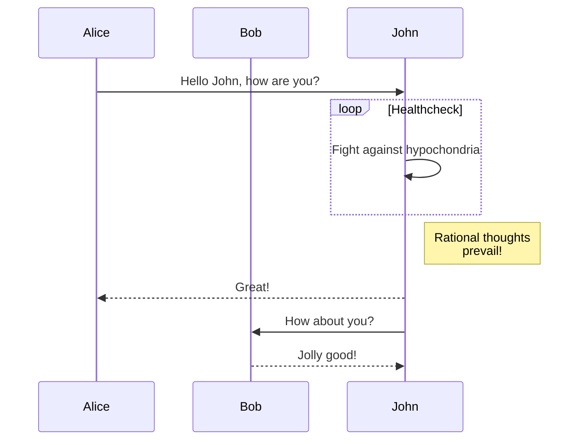
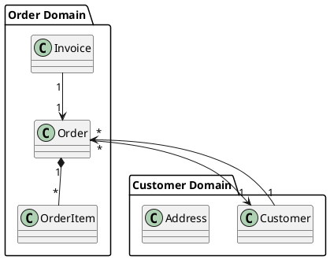

# Advanced Slidev Features
## Pushing the Boundaries of Presentations
### Created with Obsidian and Slidev

<div class="pt-12">
  <span @click="$slidev.nav.next" class="px-2 py-1 rounded cursor-pointer" hover="bg-white bg-opacity-10">
    Press Space for next page <carbon:arrow-right class="inline"/>
  </span>
</div>

<div class="abs-br m-6 flex gap-2">
  <button @click="$slidev.nav.openInEditor()" title="Open in Editor" class="text-xl slidev-icon-btn opacity-50 !border-none !hover:text-white">
    <carbon:edit />
  </button>
  <a href="https://github.com/slidevjs/slidev" target="_blank" alt="GitHub" title="View on GitHub" class="text-xl slidev-icon-btn opacity-50 !border-none !hover:text-white">
    <carbon-logo-github />
  </a>
</div>

---
layout: default
---

# Table of Contents

<Toc maxDepth="1"></Toc>

---
layout: section
---

# 1. Advanced Layouts

---
layout: two-cols
---

# Two Column Layout

This is the left column, which can contain text, lists, or any other content.

- Item 1
- Item 2
- Item 3

::right::

# Right Column

<div class="pl-4">
  
  <p class="text-sm opacity-50 italic mt-2">Image caption goes here</p>
</div>

---
layout: image-right
image: https://source.unsplash.com/collection/94734566/800x600
---

# Image Right Layout

<v-clicks>

- Perfect for presenting alongside visual content
- The image stays fixed while text scrolls
- Great for explaining diagrams or screenshots
- Fully responsive design

</v-clicks>

---
layout: image
image: https://source.unsplash.com/collection/94734566/1920x1080
class: text-center
---

# Full Image Background

<div class="bg-black/40 p-4 rounded">
Text can be placed on top of the image with a semi-transparent background for readability
</div>

---
layout: statement
---

# Statement Layout
## For impactful quotes or statements

---
layout: section
---

# 2. Code Highlighting

---

# Syntax Highlighting

```python {all|2|1-3|4|all}
def fibonacci(n):
    if n <= 1:
        return n
    return fibonacci(n-1) + fibonacci(n-2)

# Example usage
for i in range(10):
    print(fibonacci(i))
```

<arrow v-click="3" x1="350" y1="310" x2="195" y2="170" color="#564" width="2" arrowSize="1" />

---

# Multiple Languages

<div class="grid grid-cols-2 gap-4">

```python {monaco}
# Python code
def hello_world():
    print("Hello, World!")
```

```javascript
// JavaScript code
function helloWorld() {
  console.log("Hello, World!");
}
```

</div>

---
layout: section
---

# 3. Interactive Components

---
layout: center
class: text-center
---

# Interactive Counter

<div class="flex justify-center">
  <Counter :count="10" />
</div>

---
layout: iframe-right
url: https://www.openstreetmap.org/export/embed.html?bbox=-0.13%2C51.50%2C-0.12%2C51.51&layer=mapnik
---

# Embedded iFrame

You can embed external content directly in your slides.

- Perfect for demos
- Live websites
- Interactive maps
- And more!

---
layout: section
---

# 4. Diagrams & Charts

---

# Mermaid Diagrams



---

# PlantUML Support



---

# Math Equations

<div class="grid grid-cols-2 gap-4">
<div>

Inline math: $E = mc^2$

Block math:

$$
\begin{aligned}
\frac{\partial u}{\partial t} &= h^2 \left( \frac{\partial^2 u}{\partial x^2} + \frac{\partial^2 u}{\partial y^2} + \frac{\partial^2 u}{\partial z^2} \right) \\
&= h^2 \nabla^2 u
\end{aligned}
$$

</div>
<div>

Maxwell's Equations:

$$
\begin{aligned}
\nabla \times \vec{E} &= -\frac{\partial \vec{B}}{\partial t} \\
\nabla \times \vec{H} &= \vec{J} + \frac{\partial \vec{D}}{\partial t} \\
\nabla \cdot \vec{D} &= \rho \\
\nabla \cdot \vec{B} &= 0
\end{aligned}
$$

</div>
</div>

---
layout: section
---

# 5. Animations & Transitions

---

# Click Animations

<div class="grid grid-cols-2 gap-4">
<div>
<v-clicks>

- First item appears
- Second item appears
- Third item appears
- Fourth item appears

</v-clicks>
</div>
<div>
<v-clicks at="2">

- This entire list appears at click 2
- Regardless of how many items
- It contains in total

</v-clicks>
</div>
</div>

<div v-click class="mt-8 flex justify-center">
  <button class="px-4 py-2 bg-blue-500 text-white rounded">This button appears last</button>
</div>

---
transition: fade-out
---

# Slide Transitions

This slide uses a "fade-out" transition

---
transition: slide-up
---

# Slide Transitions

This slide uses a "slide-up" transition

---
transition: zoom-in
---

# Slide Transitions

This slide uses a "zoom-in" transition

---
layout: section
---

# 6. Custom Styling

---

# Custom CSS

<div class="grid grid-cols-3 gap-4">
  <div class="bg-blue-500 p-4 rounded shadow-lg text-white">
    Blue Card
  </div>
  <div class="bg-green-500 p-4 rounded-xl shadow-lg transform rotate-3 text-white">
    Green Card (Rotated)
  </div>
  <div class="bg-purple-500 p-4 rounded-full shadow-lg text-white">
    Purple Circle
  </div>
</div>

<style>
.slidev-layout {
  background-color: #f8f9fa;
  background-image: radial-gradient(#e3e3e3 1px, transparent 1px);
  background-size: 20px 20px;
}
</style>

---
layout: center
class: "text-center"
---

# Thank You!

[Documentation](https://sli.dev) · [GitHub](https://github.com/slidevjs/slidev)

<div class="pt-12">
  <span @click="$slidev.nav.next" class="px-2 py-1 rounded cursor-pointer" hover="bg-white bg-opacity-10">
    Press Space for next page <carbon:arrow-right class="inline"/>
  </span>
</div> 